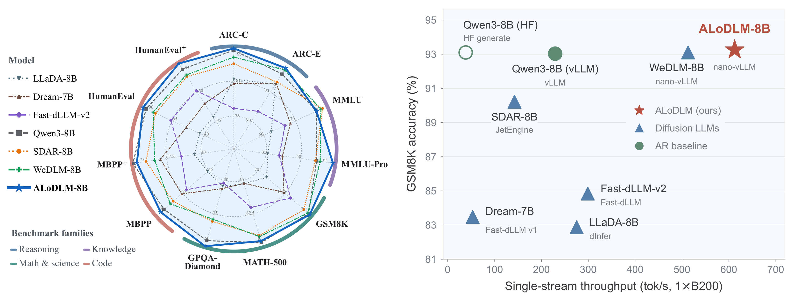
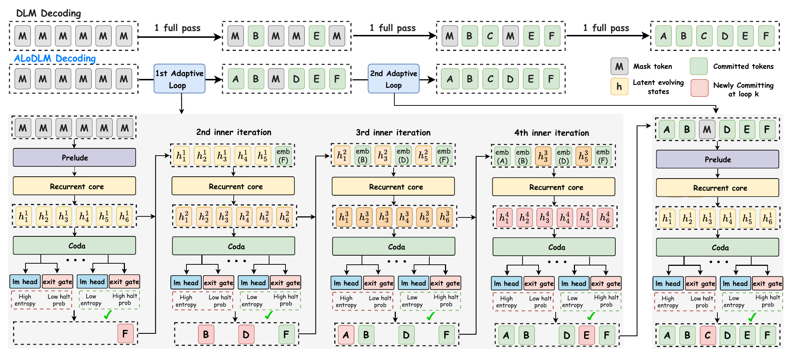

# ALoDLM: Adaptively Looped Diffusion Language Models

Diffusion language models (DLMs) enable fast generation by predicting multiple
tokens in parallel, yet their practical adoption remains hindered by a persistent
quality gap relative to comparably sized autoregressive models. We attribute
this gap to a *computation-difficulty mismatch*: within a partially observed
sequence, some unknown tokens are readily predictable, while others require
substantially more computation to resolve. Existing DLMs, however, apply uniform
computational depth to every unknown position at each denoising step.

We introduce **ALoDLM**, which replaces this uniform computation with
token-adaptive latent recurrence. At each denoising step, ALoDLM iteratively
refines representations in latent space, allocating computation based on token
difficulty. Tokens ready to commit are fed back as discrete context, while
unresolved tokens retain and refine their latent states through additional
recurrent passes. To learn both token prediction and computation allocation
end-to-end, we formulate token-wise computation schedules as latent variables
and derive a conditional negative evidence lower bound (NELBO).

We train ALoDLM at 1.7B and 8B parameter scales. Across eleven benchmarks,
ALoDLM outperforms all evaluated DLMs and the corresponding autoregressive
baselines in average benchmark score at both scales. ALoDLM combines superior
generation quality with fast parallel decoding, establishing a strong
quality-efficiency trade-off under optimized inference engines.

[Results](#results) · [Method](#method) · [Getting started](#getting-started) ·
[Training](docs/training.md) · [Evaluation](docs/evaluation.md) ·
[Limitations](#limitations)

**Weights:** [ALoDLM-1.7B](https://huggingface.co/amazon/ALoDLM-1.7B) ·
[ALoDLM-8B](https://huggingface.co/amazon/ALoDLM-8B)



*ALoDLM combines strong benchmark performance with fast parallel generation.*

## Results

Across eleven benchmarks spanning reasoning, knowledge, mathematics, and code,
ALoDLM achieves the highest average score among the evaluated diffusion models
and exceeds the corresponding Qwen3 autoregressive baseline at both scales.

| Model scale | Qwen3 (AR) | Strongest compared DLM by average | ALoDLM |
|---|---:|---:|---:|
| 1.7B | 63.8 | 61.0 (SDAR) | **65.5** |
| 8B | 78.5 | 75.1 (WeDLM) | **80.3** |

These are the paper's Table 1 results: the unweighted mean of eleven benchmark
scores, expressed as percentages. Non-code tasks use accuracy or exact match;
code tasks use execution-based pass@1. This quality comparison uses
single-token commitment at each model pass.

- **Fast parallel decoding.** On GSM8K, ALoDLM-8B delivers approximately
  **2.7× the throughput** of vLLM-served Qwen3-8B at comparable or higher accuracy,
  under single-stream inference on one NVIDIA B200.
- **Quality per unit of computation.** At the 93.25% accuracy threshold,
  the paper reports **133.5 GFLOPs per generated token** for ALoDLM versus
  154.6 for WeDLM, a **13.6% reduction** in estimated arithmetic cost.
- **Test-time scaling and token adaptivity.** Increasing the halting threshold
  raises recurrent computation and improves average score in the reported
  sweep. Numerical tokens learn a lower first-pass halting probability,
  indicating a preference for further refinement without explicit
  token-difficulty labels.

The repository includes the ALoDLM optimized inference engine. See
[optimized generation](#optimized-generation) for installation and usage.

## Method



*Token commitments and latent refinement are interleaved inside each denoising
step. A shared recurrent core reuses its parameters across passes. Entropy
selects individual token commitments; the mean gate exit CDF over unresolved
positions controls when the inner loop stops.*

### Adaptive latent recurrence

A Qwen3 backbone is partitioned into a **prelude**, a **shared recurrent core**,
and a **coda**. Each recurrent pass produces token predictions and learned
halting probabilities:

1. **Predict in parallel.** Read out predictions for unresolved positions.
2. **Commit confident tokens.** Feed their token embeddings back as context.
3. **Refine unresolved states.** Continue from their accumulated latent
   representations until the halting criterion is met or the depth cap is reached.

Two complementary controls expose the quality-speed trade-off:

| Control | Role in parallel decoding |
|---|---|
| Entropy threshold `tau` | Determines which predictions can commit. A larger threshold permits less-confident commitments and generally favors faster generation. |
| Cumulative halt threshold `q` | Determines when to end the inner loop. A larger threshold generally allows more latent refinement. |

The paper uses a maximum recurrent depth of four. At 8B, the recurrent core
contains the middle 16 Transformer layers.

### Learning where to spend computation

The paper treats token exit schedules as latent variables and derives a
conditional negative evidence lower bound to jointly learn prediction and
computation allocation. The implementation uses **sequence-level outcome
credit**: each halting decision receives credit for its effect on the sequence
as a whole.

Practical training combines a geometric depth prior, relaxed regularization of
individual and average depth profiles, a first-pass control variate, weighted
intermediate denoiser supervision, and an auxiliary next-token loss. The gate
and backbone are trained jointly. See the [training objective](docs/method.md)
for the complete implemented loss and its reductions.

## Getting started

Clone this repository and choose one of the two inference environments below.
The model weights are downloaded on first use; training is not required to try
them. Use Python 3.12 for the commands below.

```bash
git clone https://github.com/amazon-science/ALoDLM.git
cd ALoDLM
```

### Optimized generation

On Linux with an NVIDIA CUDA GPU supporting BF16, install the bundled engine in its own
environment:

```bash
python3.12 -m venv .venv-inference
source .venv-inference/bin/activate
python -m pip install --upgrade pip
python -m pip install ./optimized

alodlm-generate-optimized \
  --model amazon/ALoDLM-8B \
  --mode entropy --q 0.5 --tau 0.4 \
  --max-new-tokens 512 \
  --prompt "Explain binary search."
```

Use `--model amazon/ALoDLM-1.7B` for the smaller model, or a local model
directory. This installs the engine, cache repair, and launcher from this
repository. The runtime uses PyTorch 2.10.0, Transformers 5.5.4, and vLLM
0.19.1's compatible FlashAttention kernels. Adaptive pass CUDA graphs are
enabled for both architectures, with additional decision graphs for 8B.
Entropy is the default decoding mode.

The [generation guide](docs/inference.md) covers context limits, GPU memory,
decoding modes, and the distinction between startup and generation timing.

### Portable decoder and training environment

Use a separate environment for the portable decoder and trainer.
Python 3.10 or newer is required.

```bash
python3.12 -m venv .venv
source .venv/bin/activate
python -m pip install --upgrade pip
python -m pip install .
```

Built wheels also install the example configuration, documentation, figures,
and tests under `share/alodlm` in the Python environment. When using a wheel,
copy the training configuration from that directory before following the
commands below.

Install the evaluation or distributed-training dependencies as needed:

```bash
python -m pip install '.[evaluation]'
python -m pip install '.[distributed]'
```

The portable package pins PyTorch 2.8.0, Transformers 4.56.1, and Accelerate
1.10.1. The training example uses PyTorch SDPA; DeepSpeed 0.19.4 is optional.
The [training guide](docs/training.md) covers your own data and distributed runs.

### Portable generation

```bash
alodlm-generate \
  --model amazon/ALoDLM-8B \
  --device cuda --precision bf16 \
  --mode entropy \
  --prompt "Explain binary search." \
  --q 0.5 --tau 0.4 --max-new-tokens 512
```

Entropy is the default decoding mode and supports parallel token commitment.
Use `--model amazon/ALoDLM-1.7B` for the smaller model, or pass a local model
directory. The command downloads the backbone, trained exit gate, tokenizer,
and recurrence configuration when needed. See the [generation guide](docs/inference.md)
for authentication, hardware requirements, decoding modes, and troubleshooting.

### Train or evaluate

The supplied [configuration](configs/train.yaml) is an example for training on
your own inputs. Set the local paths, recurrence topology, and training budget
for your run, then launch:

```bash
alodlm-train --config configs/train.yaml
```

The [training guide](docs/training.md) covers input preparation, optimization,
distributed launch, and checkpoint resume.

For the 8B Table 1 quality preset, evaluate locally supplied, fully formatted
benchmark prompts with leftmost-token commitment and `q=0.5`:

```bash
alodlm-evaluate \
  --model "<LOCAL_CHECKPOINT_DIRECTORY>" \
  --input "<LOCAL_EVALUATION_JSONL>" \
  --output outputs/evaluation \
  --device cuda --precision bf16 \
  --mode left1 --q 0.5 --max-new-tokens 4096
```

The [evaluation guide](docs/evaluation.md) specifies the local input format,
benchmark scorers, code-test suites, rescoring, and accuracy/throughput reporting.

## Implementation scope

This repository contains outcome-level training, adaptive generation with
depth-aware KV caching, and evaluation from local files. Model weights are hosted on Hugging Face, and training/evaluation inputs
are supplied by the user; the repository includes no dataset
acquisition code or training-corpus details.

Two inference implementations are included: the portable PyTorch SDPA decoder
under `alodlm/`, and the optimized engine and cache repair under `optimized/`.
`alodlm-generate-optimized` runs the bundled CUDA-graph engine;
`alodlm-generate` and `alodlm-evaluate` use the portable decoder. Each command's
timing describes its own runtime. Benchmark reproduction also depends on
matching prompts, reference labels, test suites, hardware, and decoding settings.

The [optimized example](examples/generate_optimized.py) is a thin wrapper around
the installed optimized command. It requires no external engine checkout.

## Limitations

ALoDLM can have a longer time to first token than a comparable autoregressive
(AR) model. Its recurrent architecture builds depth-specific KV caches during
prompt prefill and may require multiple refinement passes before committing
the first output tokens. This additional computation can reduce the benefit
of parallel decoding for short responses or latency-sensitive interactions.

Generation speed is also input-dependent: token confidence and adaptive
stopping decisions determine the amount of recurrent computation and the
number of tokens committed in parallel. Throughput can therefore vary across
prompts, datasets, and domains, even with greedy decoding. On difficult inputs
or domains less well covered during training, additional refinement and fewer
parallel commitments may reduce or reverse the speed advantage over an
optimized AR baseline.

## Validation

In the portable environment, install the evaluation dependencies before running
the full suite:

```bash
python -m pip install '.[evaluation]'
python -m unittest discover -s tests -v
```

For a wheel installation, run discovery against `share/alodlm/tests` in the
Python environment.

The tests create small random models and synthetic inputs locally. Validation
covers the outcome gradient, masking and attention boundaries, cache behavior,
answer scoring, and an offline training-to-evaluation workflow with exact
checkpoint resume. The full suite requires the evaluation dependencies.

For the optimized environment, see the [engine checks](optimized/README.md#validation).

## Security and contributions

See [CONTRIBUTING](CONTRIBUTING.md) for the research release's contribution policy
and [security reporting](CONTRIBUTING.md#security-issue-notifications).
This project follows the [Amazon Open Source Code of Conduct](CODE_OF_CONDUCT.md).

## License and attribution

ALoDLM's original contributions, including its code, documentation, and figures,
are licensed under the [Creative Commons Attribution-NonCommercial 4.0
International license (CC BY-NC 4.0)](LICENSE), unless otherwise indicated.
The license permits non-commercial sharing and adaptation with attribution,
subject to its terms. Third-party material remains under its original licenses.

The dual-stream attention, block masking, recurrent transformer, training
losses, and answer extraction components are modified from WeDLM.
Modifications include outcome-only training, local input interfaces,
portable attention and decoding, and removal of unused training modes.
The bundled optimized engine adds adaptive recurrence, depth-aware caching,
and pass/decision CUDA graphs. See [NOTICE](NOTICE) and the
[engine notices](optimized/NOTICE) for its upstream attribution.

The supplied WeDLM distribution includes Tencent copyright notices and
third-party attribution. Its license terms are retained in
[optimized/licenses/WeDLM.txt](optimized/licenses/WeDLM.txt), including a territorial restriction.
No replacement license grant is made for these components. Model weights and
dependencies retain their own license terms.
